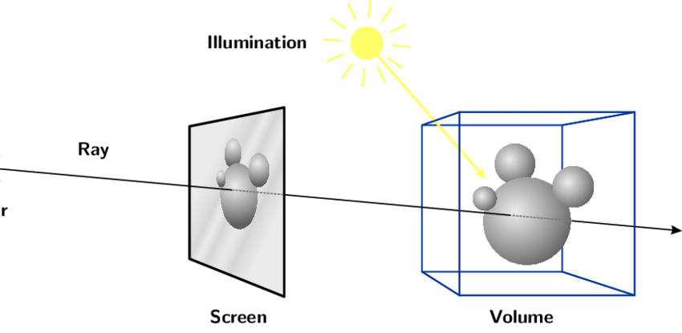

> **上一章回顾: 状态录制** <br/>
> - 你了解了如何通过 **State** 完成操作的录制和还原。<br/>
> - 熟悉地使用 **State** 相关的方法和事件。

:::tip 本章你可以学习到

- 了解 Five SDK 的事件系统。
- 获取到点的三维位置。

:::

## 准备工作

我们新建一个目录（`src/4.points-in-3d`）以及对应的 **html** 文件 以及 **js** 或 **ts** 文件。
携带着上一章的 **State** 代码，太过于繁琐，那我们从 **展示三维空间** 章的内容的基础开发。

```html title="src/4.points-in-3d/index.html"
<!DOCTYPE html>
<html lang="en">
<head>
  <meta charset="UTF-8">
  <meta http-equiv="X-UA-Compatible" content="IE=edge">
  <link rel="icon" href="data:;base64,iVBORw0KGgo=">
  <meta name="viewport" content="width=device-width, initial-scale=1.0">
  <title>三维中的点 | Points in 3d</title>
  <link href="https://cdn.jsdelivr.net/npm/bootstrap@5.1.1/dist/css/bootstrap.min.css" rel="stylesheet" crossorigin="anonymous">
  <link href="https://cdn.jsdelivr.net/npm/bootstrap-icons@1.5.0/font/bootstrap-icons.css" rel="stylesheet">
  <style>
    html, body, #app { width: 100%; height: 100%; overflow: hidden; }
  </style>
</head>
<body>
  <div id="app"></div>
  <!-- 模式切换 -->
  <nav class="navbar fixed-bottom navbar-light bg-light">
    <div class="container-fluid justify-content-center">
      <div class="btn-group">
        <button class="btn btn-primary active js-Panorama">全景漫游</button>
        <button class="btn btn-primary js-Floorplan">空间总览</button>
      </div>
    </div>
  </nav>
  <script type="module" src="./index"></script>
</body>
</html>
```

import Tabs from '@theme/Tabs';
import TabItem from '@theme/TabItem';

<Tabs>
<TabItem value="JavaScript" label="JavaScript">

```js title="src/4.points-in-3d/index.js"
import { Five, parseWork } from "@realsee/five";

const workURL = "https://vrlab-public.ljcdn.com/release/static/image/release/five/work-sample/07bdc58f413bc5494f05c7cbb5cbdce4/work.json";

const five = new Five();

five.appendTo(document.querySelector("#app"));

fetch(workURL).then(res => res.json()).then((json) => {
  const work = parseWork(json);
  five.load(work);
});

window.addEventListener("resize", () => five.refresh(), false);

{// === 模式切换 ===
  const buttons = {
    "Panorama": document.querySelector(".js-Panorama"),
    "Floorplan": document.querySelector(".js-Floorplan")
  };

  for (const [modeName, element] of Object.entries(buttons)) {
    element.addEventListener("click", () => {
      five.setState({ mode: modeName });
    }, false);
  }

  five.on("stateChange", state => {
    for (const [modeName, element] of Object.entries(buttons)) {
      if (modeName === state.mode) {
        element.classList.add("active");
      } else {
        element.classList.remove("active");
      }
    };
  });
}

export {};
```

</TabItem>
<TabItem value="TypeScript" label="TypeScript">

```ts title="src/4.points-in-3d/index.ts"
import { Five, Mode, parseWork } from "@realsee/five";

const workURL = "https://vrlab-public.ljcdn.com/release/static/image/release/five/work-sample/07bdc58f413bc5494f05c7cbb5cbdce4/work.json";

const five = new Five();

five.appendTo(document.querySelector("#app")!);

fetch(workURL).then(res => res.json()).then((json) => {
  const work = parseWork(json);
  five.load(work);
});

window.addEventListener("resize", () => five.refresh(), false);

{// === 模式切换 ===
  const buttons: Partial<Record<Mode, Element>> = {
    "Panorama": document.querySelector(".js-Panorama")!,
    "Floorplan": document.querySelector(".js-Floorplan")!
  };

  for (const [modeName, element] of Object.entries(buttons)) {
    element.addEventListener("click", () => {
      five.setState({ mode: modeName as Mode });
    }, false);
  }

  five.on("stateChange", state => {
    for (const [modeName, element] of Object.entries(buttons)) {
      if (modeName === state.mode) {
        element.classList.add("active");
      } else {
        element.classList.remove("active");
      }
    };
  });
}

export {};
```

</TabItem>
</Tabs>


启动服务 `npm run dev`。 并跳转到当前页面 "http://localhost:3000/src/4.points-in-3d"。

:::tip
请查看你的控制台，端口号会因为你的配置以及当前端口占用情况变更，请已控制台输出的为准。  
如果你使用其他开发构建工具，请按照自己的开发构建工具的要求启动服务。
:::
## 事件系统

在屏幕上点击时，**five SDK** 的默认行为是选择点击位置附近最合适的 **观察点(observer)** 移动过去。大部分用户的动作都是如此，就好比浏览器对于 **A 标签** 的处理逻辑大多都是链接跳转。上述就是 **five SDK** 的内建 **tapGesture**事件。

### 内建事件

**five SDK** 内建的事件有如下:
- **tapGesture**: 鼠标左键点击或者手指点击。默认行为是点位移动；
- **panGesture**: 鼠标按住一栋或者手指在屏幕上拖拽移动。相机旋转（Topview下是相机平移）；
- **pinchGesture**: 手指双指做捏的手势。默认行为是修改相机可视角度；
- **mouseWheel**: 鼠标滚轮。默认行为是修改相机可视角度；
- **gesture**: 上述的任意事件。

### 阻止默认行为

所有事件和 浏览器对于 **A 标签** 的处理逻辑 一样，都可以阻止默认事件，你只需要监听 `wants` 开头的事件，在回调函数中 `return false` 即可。比如想阻止 **tapGesture** 的默认点位移动行为。可以做如下操作。

```js
five.on("wantsTapGesture", () => {
  // 阻止 tapGesture 触发
  return false;
});
```

具体每个事件的 API 可以查看详细文档
- [tapGesture](https://unpkg.com/@realsee/five/docs/interfaces/five.EventCallback.html#tapGesture)
- [panGesture](https://unpkg.com/@realsee/five/docs/interfaces/five.EventCallback.html#panGesture)
- [pinchGesture](https://unpkg.com/@realsee/five/docs/interfaces/five.EventCallback.html#pinchGesture)
- [mouseWheel](https://unpkg.com/@realsee/five/docs/interfaces/five.EventCallback.html#mouseWheel)
- [gesture](https://unpkg.com/@realsee/five/docs/interfaces/five.EventCallback.html#gesture)

## 从 tapGesture 获取坐标

> 我们制作一个简单功能，用于标记在画布上点击的三维位置。
> 但是为了和 **点位移动** 功能不冲突，我们用一个 `Switch` 按钮来控制标记状态是否开启。

### 头部添加依赖

本章需要介绍一下 [three.js](http://threejs.org) 了。**three.js** 是一个三维图形库，**Five SDK** 使用 **three.js** 的数学库和渲染器。本章涉及 **three.js** 有两个内容，在这里做一些说明，你不必完全了解 **three.js**, 我做一些说明你就可以理解。

- [`THREE.Vector3`](https://threejs.org/docs/index.html#api/zh/math/Vector3): 你可以就认为是一个 `{ x: number, y: number, z: number }` 的结构体，并且多加了一些数学方法（本次不会用到数学方法，只是记录xyz）
- [`THREE.Raycaster`](https://threejs.org/docs/index.html#api/zh/core/Raycaster): 光线投射类。你可以简单的理解为屏幕上的一个点对应到三维空间是一条射线。

 

射线有很多作用，比如：通过射线和模型之前的相交性检测，就可以判断是否对象被选中。

### 构建 UI

```html title="src/4.points-in-3d/index.html"
<!DOCTYPE html>
<html lang="en">
<head>
  <meta charset="UTF-8">
  <meta http-equiv="X-UA-Compatible" content="IE=edge">
  <link rel="icon" href="data:;base64,iVBORw0KGgo=">
  <meta name="viewport" content="width=device-width, initial-scale=1.0">
  <title>三维中的点 | Points in 3d</title>
  <link href="https://cdn.jsdelivr.net/npm/bootstrap@5.1.1/dist/css/bootstrap.min.css" rel="stylesheet" crossorigin="anonymous">
  <link href="https://cdn.jsdelivr.net/npm/bootstrap-icons@1.5.0/font/bootstrap-icons.css" rel="stylesheet">
  <style>
    html, body, #app { width: 100%; height: 100%; overflow: hidden; }
  </style>
</head>
<body>
  <div id="app"></div>
  <!-- 模式切换 -->
  <nav class="navbar fixed-bottom navbar-light bg-light">
    <div class="container-fluid justify-content-center">
      <div class="btn-group">
        <button class="btn btn-primary active js-Panorama">全景漫游</button>
        <button class="btn btn-primary js-Floorplan">空间总览</button>
      </div>
    </div>
  </nav>
  <!-- highlight-start -->
  <!-- 标记三维坐标 -->
  <div class="card position-fixed m-2 top-0 start-0">
    <div class="form-check form-switch m-2">
      <input class="form-check-input js-mark-switch" type="checkbox">
      <label class="form-check-label" for="flexSwitchCheckDefault">标记</label>
    </div>
    <div class="js-marks"></div>
  </div>
  <!-- highlight-end -->
  <script type="module" src="./index"></script>
</body>
</html>
```

### 编写 **MarkController** 组件

1. `switcher` 为是否开启标记模式的开关。
2. 如果标记模式下，通过 `wansTapGesture` 获取到点击行为，回调函数第一个参数是 `raycaster`，碰撞射线。
3. 通过 `model.intersectRaycaster(raycaster)` 可以获取到焦点信息 `intersect`，`intersect.point` 就是交点的坐标

<Tabs>
<TabItem value="JavaScript" label="JavaScript">

在 **模式切换** 的代码后追加：

```js title="src/4.points-in-3d/index.js"
{ // === 标记三维坐标 ===
  const list = document.querySelector(".js-marks");
  const switcher = document.querySelector(".js-mark-switch");

  five.on("wantsTapGesture", (raycaster) => {
    if (switcher.checked) {
      const [intersect] = five.model.intersectRaycaster(raycaster);
      if (intersect) {
        const { x, y, z } = intersect.point;
        const p = document.createElement("p");
        p.className = "badge bg-primary d-block m-2";
        list.appendChild(p);
        const span = document.createElement("span");
        span.innerHTML = `x=${x.toFixed(2)} y=${y.toFixed(2)} z=${z.toFixed(2)}`;
        p.appendChild(span);
        const close = document.createElement("i");
        close.className = "bi bi-x-circle ms-2";
        close.addEventListener("click", () => list.removeChild(p), false);
        p.appendChild(close);
      }
      return false;
    }
  });
}
```

</TabItem>
<TabItem value="TypeScript" label="TypeScript">

在 **模式切换** 的代码后追加：

```ts title="src/4.points-in-3d/index.ts"
{ // === 标记三维坐标 ===
  const list = document.querySelector(".js-marks")!;
  const switcher: HTMLInputElement = document.querySelector(".js-mark-switch")!;

  five.on("wantsTapGesture", (raycaster) => {
    if (switcher.checked) {
      const [intersect] = five.model.intersectRaycaster(raycaster);
      if (intersect) {
        const { x, y, z } = intersect.point;
        const p = document.createElement("p");
        p.className = "badge bg-primary d-block m-2";
        list.appendChild(p);
        const span = document.createElement("span");
        span.innerHTML = `x=${x.toFixed(2)} y=${y.toFixed(2)} z=${z.toFixed(2)}`;
        p.appendChild(span);
        const close = document.createElement("i");
        close.className = "bi bi-x-circle ms-2";
        close.addEventListener("click", () => list.removeChild(p), false);
        p.appendChild(close);
      }
      return false;
    }
  });
}
```

</TabItem>
</Tabs>


回到你的浏览器查看，会发现你的页面左上角出现一个选择开关。打开开关，点击画布内容，会输出点击位置的坐标。

真棒，一下子就理解和获取到了三维坐标🥳 。

## 下一章节你会学到

:::tip 下一章我们将实现一个空间标签功能，不要错过哦。
:::
