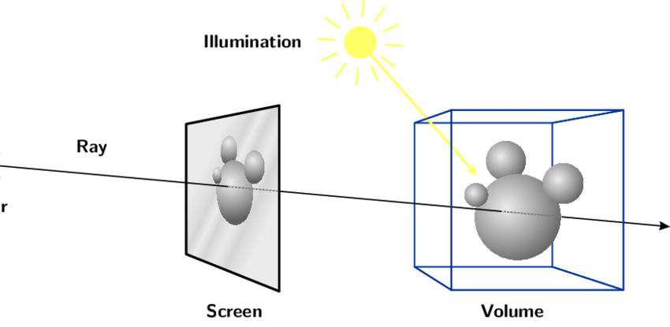

> **Previous chapter recalls: Status Recording** <br/> - You know how to record and restore operations through **State**.<br/> - Knowingly use **State** related methods and events.

:::tip This chapter can learn to

- Learn about the Live SDK event system.
- Gets a three-dimensional position to a point.

:::

## Preparatory work

We create a new directory (`src/4.points-in-3d`and corresponding **htm** file and **jsx** or **tsx** file. The **State** code with the previous chapter is too onerous, and we show the base development of the contents of **the three-dimensional space** chapter from.

```html title="src/4.points-in-3d/index.html"
<!DOCTYPE html>
<html lang="en">
  <head>
    <meta charset="UTF-8" />
    <link rel="icon" href="data:;base64,iVBORw0KGgo=" />
    <meta name="viewport" content="width=device-width, initial-scale=1.0" />
    <title>points in 3d</title>
    <link
      href="https://cdn.jsdelivr.net/npm/bootstrap@5.1.1/dist/css/bootstrap.min.css"
      rel="stylesheet"
      crossorigin="anonymous"
    />
    <link
      href="https://cdn.jsdelivr.net/npm/bootstrap-icons@1.5.0/font/bootstrap-icons.css"
      rel="stylesheet"
    />
    <style>
      * {
        margin: 0;
        padding: 0;
      }

      html,
      body,
      #App {
        width: 100%;
        height: 100%;
        overflow: hidden;
      }
    </style>
  </head>

  <body>
    <div id="app"></div>
    <script type="module" src="./index"></script>
  </body>
</html>
```

import Tabs from '@theme/Tabs';
import TabItem from '@theme/TabItem';

<Tabs>
<TabItem value="JavaScript" label="JavaScript">

```js title="rc/4.points-in-3d/useWindowDimensions.js"
import {ref, onBeforeUnmount} from "vue"

function useWindowDimensions() {
    const width = ref(window.innerWidth);
    const height = ref(window.innerHeight);

    const listener = () => {
        width.value = window.innerWidth;
        height.value = window.innerHeight;
    }

    window.addEventListener("resize", listener, false)
    onBeforeUnmount(() => {
        window.removeEventListener("resize", listener, false)
    })
    return { width , height }
}
export { useWindowDimensions }
```

```vue title="src/4. oints-in-3d/ModeController.vue"
<template>
  <nav class="navbar fixed-bottom navbar-light bg-light">
    <div class="container-fluid justify-content-center">
      <div class="btn-group">
        <button
          :class="
            state.mode == 'Panorama'
              ? 'btn btn-primary active'
              : 'btn btn-primary'
          "
          @click="() => setState({ mode: Five.Mode.Panorama })"
        >
          Panorama roaming
        </button>
        <button
          :class="
            state.mode == 'Panorama'
              ? 'btn btn-primary'
              : 'btn btn-primary active'
          "
          @click="() => setState({ mode: Five.Mode.Floorplan })"
        >
          Space overview
        </button>
      </div>
    </div>
  </nav>
</template>

<script setup>
import { useFiveCurrentState } from "@realsee/five/vue";
import { Five } from "@realsee/five";

const [state, setState] = useFiveCurrentState();
</script>
```

```vue title="src/4.points-in-3d/App.vue"
<template>
  <FiveProvider :work="work">
    <FiveCanvas :width="width" :height="height" />
    <ModeController />
  </FiveProvider>
</template>

<script setup>
import { FiveProvider, FiveCanvas } from "@realsee/five/vue";
import { parseWork } from "@realsee/five";
import { ref } from "vue";
import { useWindowDimensions } from "./useWindowDimensions";
import ModeController from "./ModeController.vue";

const work = ref();
const workURL =
  "https://vrlab-public.ljcdn.com/release/static/image/release/five/work-sample/07bdc58f413bc5494f05c7cbb5cbdce4/work.json";

fetch(workURL)
  .then((response) => response.text())
  .then((text) => (work.value = parseWork(text)));
const { width, height } = useWindowDimensions();
</script>
```

```js title="src/4.points-in-3d/index.js"
import { createApp } from "vue";
import App from "./App.vue";

createApp(App).mount("#app");
```

</TabItem>
<TabItem value="TypeScript" label="TypeScript">

```ts title="src/4.points-in-3d/useWindowDimensions.ts"
import { ref, onBeforeUnmount } from "vue";

function useWindowDimensions() {
  const width = ref<number>(window.innerWidth);
  const weight = ref<number>(window.innerHeight);

  const listener = () => {
    width.value = window.innerWidth;
    height.value = window.innerHeight;
  };

  window.addEventListener("resize", listener, false);
  onBeforeUnmount(() => {
    window.removeEventListener("resize", listener, false);
  });
  return { width, height };
}
export { useWindowDimensions };
```

```vue title="src/4. oints-in-3d/ModeController.vue"
<template>
  <nav class="navbar fixed-bottom navbar-light bg-light">
    <div class="container-fluid justify-content-center">
      <div class="btn-group">
        <button
          :class="
            state.mode == 'Panorama'
              ? 'btn btn-primary active'
              : 'btn btn-primary'
          "
          @click="() => setState({ mode: Five.Mode.Panorama })"
        >
          Panorama roaming
        </button>
        <button
          :class="
            state.mode == 'Panorama'
              ? 'btn btn-primary'
              : 'btn btn-primary active'
          "
          @click="() => setState({ mode: Five.Mode.Floorplan })"
        >
          Space overview
        </button>
      </div>
    </div>
  </nav>
</template>

<script setup lang="ts">
import { useFiveCurrentState } from "@realsee/five/vue";
import { Five } from "@realsee/five";

const [state, setState] = useFiveCurrentState();
</script>
```

```vue title="src/4.points-in-3d/App.vue"
<template>
  <FiveProvider :work="work">
    <FiveCanvas :width="width" :height="height" />
    <ModeController />
  </FiveProvider>
</template>

<script setup lang="ts">
import { FiveProvider, FiveCanvas } from "@realsee/five/vue";
import { parseWork } from "@realsee/five";
import { ref } from "vue";
import { useWindowDimensions } from "./useWindowDimensions";
import ModeController from "./ModeController.vue";

const work = ref();
const workURL =
  "https://vrlab-public.ljcdn.com/release/static/image/release/five/work-sample/07bdc58f413bc5494f05c7cbb5cbdce4/work.json";

fetch(workURL)
  .then((response) => response.text())
  .then((text) => (work.value = parseWork(text)));
const { width, height } = useWindowDimensions();
</script>
```

```ts title="src/4.points-in-3d/index.ts"
import { createApp } from "vue";
import App from "./App.vue";

createApp(App).mount("#app");
```

</TabItem>
</Tabs>

Start service `npm run dev` and jump to the current page "http://localhost:3000/src/4.points-in-3d/index.html".

:::info
Please see your console. The port number will change due to your configuration and current port occupancy, please check the console output. If you use another development build tool, please start the service as required by your own development build tool.
:::

## Event System

When clicking on the screen, the default behavior of**five SDK** is to select the most appropriate **observation near the location of the clicked** to move the past.This is true of most users' actions, and the processing logic of **A tag** is mostly linked to the link jumps.The above is the builtin of **five SDK** **tapGesture**events.

### Built-in Events

**five SDK** built-in events are as follows：

- **tapGesture**: left mouse click or finger.Default behavior is a point move.
- **panGest**: mouse over one mouse or drag and drop the finger on the screen.Camera rotation (camera shift under Topview).
- **pinchGesture**: finger to make fabricated gestures.The default behavior is to modify camera visualizations.
- **mouseWheel**: Mouse Wheel.The default behavior is to modify camera visualizations.
- **gesture**: any of the events above.

### Block default behavior

All events and browser's handling logic for **A tag** can block default events, you simply listen to `wants` at the beginning of the callback function `return false`.For example, want to block the default point movement of **tapGesture**.This can be done as follows.

```js
useFiveEventCallback("wantsTapGesure", () => {
  // block tapGest trigger
  return false;
});
```

The API for each event can view detailed documents

- [tapGesture](https://unpkg.com/@realsee/five/docs/interfaces/five.EventCallback.html#tapGesture)
- [panGesture](https://unpkg.com/@realsee/five/docs/interfaces/five.EventCallback.html#panGesture)
- [pinchGesture](https://unpkg.com/@realsee/five/docs/interfaces/five.EventCallback.html#pinchGesture)
- [mouseWheel](https://unpkg.com/@realsee/five/docs/interfaces/five.EventCallback.html#mouseWheel)
- [gesture](https://unpkg.com/@realsee/five/docs/interfaces/five.EventCallback.html#gesture)

## Get coordinates from tapGesture

> We make a simple feature to mark the 3-D position on the canvas. But in order not to conflict with the **point move** feature, we use a `Switch` button to control whether or not the marker status is enabled.

### Header Add Dependencies

This chapter needs to introduce [three.js](http://threejs.org).**three.js** is a three-dimensional graphics library,**Five SDK** uses **three.js**.This chapter is related to **three.js** and make some instructions here, you don't need to be fully aware of **three.js**, I can understand you by making some instructions.

- [`THREE.Vector3`](https://threejs.org/docs/index.html#api/zh/math/Vector3): you can think of a structure that is `{ x: number, y: number, z: number }` and add some mathematical methods (this time won't use a mathematical method, just record xyz)
- [`THREE.Raycaster`](https://threejs.org/docs/index.html#api/zh/core/Raycaster): light projecting class.You can simply understand that a point on the screen corresponding to a three-dimensional space is a ray.

;

The rays have many effects, such as：passing the intersection test before the ray and model to determine if the object is selected.

### Write **MarkController** Component

1. Add a **MarkController** file to write components.
2. We control whether the current app is in tagged mode with **active** Vue Ref Responsive API combination v-models.
3. By `tapGesture` the first parameter is `raycaster`, by `modelIntersectRaycaster` the focus information can be retrieved `intersect`,`intersect.point` is the coordinates of the node.
4. Store all interfaces with `marks` Vue Ref and implement collection and deletion.

<Tabs>
<TabItem value="JavaScript" label="JavaScript">

```vue title="rc/4.points-in-3d/MarkController.vue"
<template>
  <div class="card position-fixed m-2 top-0 start-0">
    <div class="form-check form-switch m-2">
      <input class="form-check-input" type="checkbox" v-model="isSwitch" />
      <label class="form-check-label" for="flexSwitchCheckDefault">Tag</label>
    </div>
    <div class="js-marks" v-if="marks.length > 0">
      <p v-for="(v3, index) in marks" calss="badge bg-primary d-block m-2">
        <span
          >x={{ v3.x.toFixed(2) }} y ={{ v3.y.toFixed(2) }} z={{
            v3.z.toFixed(2)
          }}</span
        >
        <i
          class="bi bi-x-circle ms-2"
          @click="
            () => {
              removeMark(index);
            }
          "
        ></i>
      </p>
    </div>
  </div>
</template>
<script setup>
import {
  useFiveEventCallback,
  useFiveModelIntersectRaycaster,
} from "@realsee/five/vue";
import { Raycaster } from "three";
import { ref } from "vue";
const marks = ref([]);
const isSwitch = ref(false);
const raycasterRef = ref(new Raycaster());
const fiveModelIntersectRaycaster = useFiveModelIntersectRaycaster();
const intersect = fiveModelIntersectRaycaster(raycasterRef);

useFiveEventCallback("wantsTapGesture", (raycaster, tapPosition) => {
  if (isSwitch.value) {
    raycasterRef.value = raycaster;
    if (intersect.value[0]?.point) marks.value.push(intersect.value[0]?.point);
    return false;
  }
});

const removeMark = (index) => {
  marks.value.splice(index, 1);
};
</script>
```

</TabItem>
<TabItem value="TypeScript" label="TypeScript">

```vue title="rc/4.points-in-3d/MarkController.vue"
<template>
  <div class="card position-fixed m-2 top-0 start-0">
    <div class="form-check form-switch m-2">
      <input class="form-check-input" type="checkbox" v-model="isSwitch" />
      <label class="form-check-label" for="flexSwitchCheckDefault">Tag</label>
    </div>
    <div class="js-marks" v-if="marks.length > 0">
      <p v-for="(v3, index) in marks" calss="badge bg-primary d-block m-2">
        <span
          >x={{ v3.x.toFixed(2) }} y ={{ v3.y.toFixed(2) }} z={{
            v3.z.toFixed(2)
          }}</span
        >
        <i
          class="bi bi-x-circle ms-2"
          @click="
            () => {
              removeMark(index);
            }
          "
        ></i>
      </p>
    </div>
  </div>
</template>
<script setup lang="ts">
import {
  useFiveEventCallback,
  useFiveModelIntersectRaycaster,
} from "@realsee/five/vue";
import { Raycaster } from "three";
import { ref } from "vue";
const marks = ref<THREE.Vector3[]>([]);
const isSwitch = ref(false);
const raycasterRef = ref<Raycaster>(new Raycaster());
const fiveModelIntersectRaycaster = useFiveModelIntersectRaycaster();
const intersect = fiveModelIntersectRaycaster(raycasterRef);

useFiveEventCallback("wantsTapGesture", (raycaster, tapPosition) => {
  if (isSwitch.value) {
    raycasterRef.value = raycaster;
    if (intersect.value[0]?.point) marks.value.push(intersect.value[0]?.point);
    return false;
  }
});

const removeMark = (index: number) => {
  marks.value.splice(index, 1);
};
</script>
```

</TabItem>
</Tabs>

### Use Tag Component

Insert into **App** file **GiveProvider**

<Tabs>
<TabItem value="JavaScript" label="JavaScript">

```vue title="rc/4.points-in-3d/App.vue"
<template>
  <FiveProvider :work="work">
    <FiveCanvas :width="width" :height="height" />
    <ModeController />
    // Highlight-start
    <MarkController />
    // highlight-end
  </FiveProvider>
</template>

<script setup>
import { FiveProvider, FiveCanvas } from "@realsee/five/vue";
import { parseWork } from "@realsee/five";
import { ref } from "vue";
import { useWindowDimensions } from "./useWindowDimensions";
import ModeController from "./ModeController.vue";
// highlight-start
import MarkController from "./MarkController.vue";
// highlight-end

const work = ref();
const workURL =
  "https://vrlab-public.ljcdn.com/release/static/image/release/five/work-sample/07bdc58f413bc5494f05c7cbb5cbdce4/work.json";

fetch(workURL)
  .then((response) => response.text())
  .then((text) => (work.value = parseWork(text)));
const { width, height } = useWindowDimensions();
</script>
```

</TabItem>
<TabItem value="TypeScript" label="TypeScript">

```vue title="rc/4.points-in-3d/App.vue"
<template>
  <FiveProvider :work="work">
    <FiveCanvas :width="width" :height="height" />
    <ModeController />
    // Highlight-start
    <MarkController />
    // highlight-end
  </FiveProvider>
</template>

<script setup lang="ts">
import { FiveProvider, FiveCanvas } from "@realsee/five/vue";
import { parseWork, Work } from "@realsee/five";
import { ref } from "vue";
import { useWindowDimensions } from "./useWindowDimensions";
import ModeController from "./ModeController.vue";
// highlight-start
import MarkController from "./MarkController.vue";
// highlight-end

const work = ref<Work>();
const workURL =
  "https://vrlab-public.ljcdn.com/release/static/image/release/five/work-sample/07bdc58f413bc5494f05c7cbb5cbdce4/work.json";

fetch(workURL)
  .then((response) => response.text())
  .then((text) => (work.value = parseWork(text)));
const { width, height } = useWindowDimensions();
</script>
```

</TabItem>
</Tabs>

Go back to your browser and find a switch in the upper left corner of your page.Turn on the switch, tap on the content of the canvas and output the coordinates of the click position.

Graby, understand and get three-dimensional coordinates: partying_face:

## The next section will be completed by you

:::tip Next chapter we will implement a space tag feature, don't miss it.
:::
