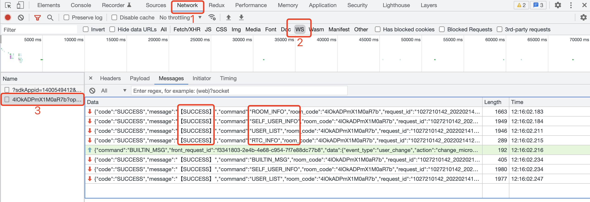

import Tabs from '@theme/Tabs';
import TabItem from '@theme/TabItem'

:::tip
This description does not take into account the ability to view the voice.
:::

**Please select the sample instructions to view according to the actual development framework.**

## No Frame Example

**This indicates that you are using native `js` | `ts` for app development.**

### Create Instance

```js
import { createLive } from "@realsee/live";

const live = createLive({
  __debug__: true, // This mode will allow debugging in terminal print logs, which is recommended when developing.
  url: "wss://ws-access.realsee.com/***/?=xxx" /* URL to connect to WebSocket service, get it from your backend */,
  getTicket: async () => {
    /* Get the callback function with "ticket" */
  },
});
```

**Two arguments configured when creating live instance：**

- **url**：The URL to connect to the WebSocket service. If you do not know the URL at the stage of creating a live instance, you can use the `live.connect({ url })` method to make a WebSocket connection at the right time.
- **getTicket()**：is an asynchronous callback function with a return value of **"Door" connected to WebSocket service,**for how to get a ticket see the VR Belt API.

:::info
for `createLive()` for more function configuration refer to [LiveOptions](https://unpkg.com/@realsee/live@0.2.0-alpha.1/docs/interfaces/live.LiveOptions.html).
:::

### Connections Belt

After obtaining the `live` instance, use the `connect()` method at an appropriate time to connect with viewing.

```js
// Make sure you get an instance of `live` with a simple `console.log(live)`.
live.connect();
```

### 3. Successful connection identifier

:::tip
by `live.on` listening `readyKeyframeSync` events were informed about whether the interaction with the screen was successfully created
:::

```js
live.on("readyKeyframeSync", (lastframe) => {
  console.log("Successful Enrollment");
});
```

:::tip
You can also quickly see whether you are connected to the console or not.
:::



As shown in the graph above, if `ROOM_INO`, `SELF_USER_INFO`, `USER_LIST`, `RTC_INT` all four instructions (command) code and messaging are `SUCCESS`the link is successful.

## React Example

**This indicates that you use the `React` framework for app development.**

### Create Instance

:::info
New file `LiveReact.js` | `LiveReact.ts` and create your own LiveReact instance
:::

<Tabs>
<TabItem value="JavaScript">

```jsx title='LiveReact.js'
import { createLiveReact } from "@realsee/live";

const LiveReact = createLiveReact({
  __debug__: true,
});

export default LiveReact;

/** if you do not like `LiveReact. iveProvider`, such programming habits that you can "throw */
// export const LiveProvider = liveReactInstance.LiveProvider
// export const useConnect = liveReactInstance. seConnect
// export const useKeyframe = liveReactInstance.useKeyframe
// export...
```

</TabItem>
<TabItem value="TypeScript">

```tsx title='LiveReact.ts'
import { createLiveReact } from "@realsee/live";
import { Mode } from "@relasee/five";

/** Define frame data snapshot structure*/
interface Snapshot {
  /** Take the Five state snapshot as an example*/
  FiveState: {
    panoIndex: number;
    fov: number;
    mode: Mode;
    latitude: number;
    longitude: number;
  };
}

/** Create an instance through `createLiveReact()` function* /
const LiveReact = createLiveReact<Snapshot>({
    __debug__: true
})

export default LiveReact

/** if you do not like such programming habits as `LiveReact.LiveProvider`, you can "drop "hold */
// export const LiveProvider = LiveReact. iveProvider
// export const useConnect = LiveReact.useConnect
// export const useKeyframe = LiveReact.useKeyframe
// export...
```

</TabItem>
</Tabs>

### Integration context

:::info
Integrate `live` instances into `React` 's `Context` context through `LiveProvider`.
:::

<Tabs>
<TabItem value="JavaScript">

```jsx
ReactDOM.render(
  <LiveProvider>
    <App />
  </LiveProvider>,
  document.getElementById("root") // Please change this to your container
);
```

</TabItem>
<TabItem value="TypeScript">

```tsx
ReactDOM.render(
  <LiveProvider>
    <App />
  </LiveProvider>,
  document.getElementById("root") // Please change this to your container
);
```

</TabItem>
</Tabs>

### 3 - Connections Belt

:::info
Use `useConnect` hook to see connections.
:::

<Tabs>
<TabItem value="JavaScript">

```jsx
import { useConnect } from "./LiveReact";

function ConnectBtn() {
  // highlight-start
  const connect = useConnect();
  //  highlight-end

  const handleConnect = () => {
    return Promise.resolve().then(() => {
      // highlight-start
      connect({
        force: true,
        url: wsUrl, // ws connection gets from your backend
        getTicket: async () => {
          // Take a look at the ticket callback method
          return await requestTicket({ roomCode, userId, userRole });
        },
      });
      //  highlight-end
    });
  };

  return (
    <button onClick={() => handleConnect()}>
      connect with the look at the example button
    </button>
  );
}

const requestTicket = async ({ roomCode, userId, userRole }) => {
  // request backend interface, return ticket
  return ""; // string
};
```

</TabItem>
<TabItem value="TypeScript">

```tsx
import { useConnect } from "./LiveReact";

function ConnectBtn() {
  // highlight-start
  const connect = useConnect();
  //  highlight-end

  const handleConnect = () => {
    return Promise.resolve().then(() => {
      // highlight-start
      connect({
        force: true,
        url: wsUrl, // ws connection fetch from your backend
        getTicket: async () => {
          // Take a look at the ticket callback method
          return await requestTicket({
            roomCode: string,
            userId: string,
            userRole: string,
          });
        },
      });
      //  highlight-end
    });
  };

  return (
    <button onClick={() => handleConnect()}>
      connect with the look at the example button
    </button>
  );
}

const requestTicket = async ({
  roomCode,
  userId,
  userRole,
}: {
  string;
  string;
  string;
}) => {
  // Request backend interface, return ticket
  return ""; // string
};
```

</TabItem>
</Tabs>

### 4 - Identification of successful connections

<!--

    > 通过 `useReadyState` hook 监听 Websocket 通道连接状态。

    <Tabs>
    <TabItem value="JavaScript">

    ```jsx
    import LiveReact from "./LiveReact.js";
    import { WebSocketState } from "@realsee/live/lib/typings/WebSocket"

    const { useReadyState } = LiveReact

    function Test() {
        const wsStatus = useReadyState()

        React.useEffect(() => {
            switch (wsStatus) {
                case WebSocketState.NOTINITIALIZED:
                    // 尚未初始化
                    break;
                case WebSocketState.CONNECTING:
                    // 正在链接中
                    break;
                case WebSocketState.OPEN:
                    // 已经链接并且可以通讯
                    break;
                case WebSocketState.CLOSING:
                    // 连接正在关闭
                    break;
                case WebSocketState.CLOSED:
                    // 连接已关闭或者没有链接成功
                    break;
                default:
                    return null
            }
        }, [wsStatus])

        return null
    }
    ```

    </TabItem>
    <TabItem value="TypeScript">

    ```tsx
    import LiveReact from "./LiveReact.ts";
    import { WebSocketState } from "@realsee/live/lib/typings/WebSocket"

    const { useReadyState } = LiveReact

    function Test() {
        const wsStatus = useReadyState()

        React.useEffect(() => {
            switch (wsStatus) {
                case WebSocketState.NOTINITIALIZED:
                    // 尚未初始化
                    break;
                case WebSocketState.CONNECTING:
                    // 正在链接中
                    break;
                case WebSocketState.OPEN:
                    // 已经链接并且可以通讯
                    break;
                case WebSocketState.CLOSING:
                    // 连接正在关闭
                    break;
                case WebSocketState.CLOSED:
                    // 连接已关闭或者没有链接成功
                    break;
                default:
                    return null
            }
        }, [wsStatus])

        return null
    }
    ```

    </TabItem>
    </Tabs>

-->

:::info
Listen to `useLiveEventCallback` hook to list `readyKeyframeSync` Event to see if the interface with the screen was successfully created :
:::

```js
// Set up with the channel, homescreen data sync
useLiveEventCallback("readyKeyframeSync", (lastKeyframe) => {
  // live channel ready
  console.log("Successful Access with Watch");

  // recover first screen frame
  if (JSON.stringify(lastKeyframe) !== "{}") {
    // If lastKeyframe does not exist, there is no frame data, Scene recovery required
    for (const key in lastKeyframe) {
      if (lastKeyframe.hasOwnProperty(key)) {
        switch (key) {
          case "FiveState":
            setDefaultFiveState(lastKeyframe[key]);
            break;
          default:
            return;
        }
      }
    }
  }
});
```

:::tip
You can also quickly see whether you are connected to the console or not.
:::


As shown in the graph above, if `ROOM_INO`, `SELF_USER_INFO`, `USER_LIST`, `RTC_INT` all four instructions (command) code and messaging are `SUCCESS`the link is successful.
