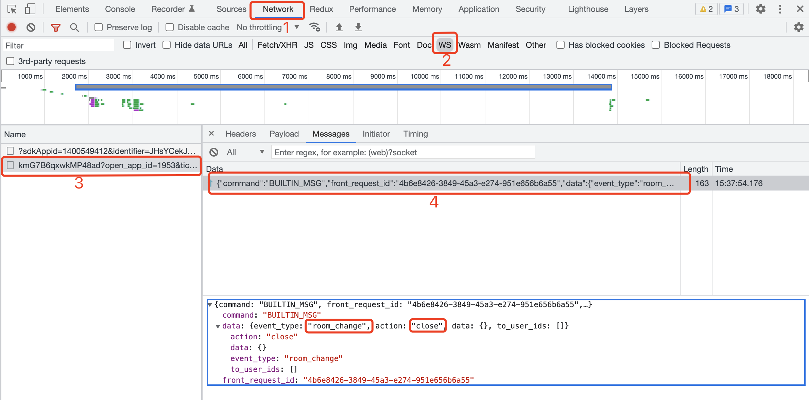

import Tabs from "@theme/Tabs";
import TabItem from "@theme/TabItem";

:::tip
If you have language features, exit will exit voice connections by default.
:::

**Normally there are two situations that need to be watched out with watch：**

- **1, users quit and see the room**<br/> `exit()` methods to operate, by `exit()` methods to see if they are exit.<br/> Other exit() exits triggered by active program call `exit()` are attributed to the user's active exit tabs.

- **2, with a watching room closed**<br/> tabs with room closed to listen to internal events `builtinEvent` , determine if the return action is `RoomClose` type, and learn if you want to quit.

Details of the developments described above are set out below.

## No Frame Example

**This indicates that you are using native `js` | `ts` for app development.**

### Call exit method

:::info
via `exit()` method, follow exit.
:::

```js
// Make sure you get an instance of `live` with a simple `console.log(live)`.
live.exit().then(() => {
  console.log("Exit with Look");
});
```

### The listening room is closed

```ts
import { BuiltinActionType } from "@realsee/live/lib/typings/LiveMsg";

live.on("builtinEvent", (builtinMsg) => {
  if (builtinMsg.action === BuiltinActionType.RoomClose) {
    // Close the room with viewing , exit with see
  }
});
```

### 3. Successful exit identification

:::tip
You can also quickly see how successfully to exit in the console.
:::



As shown in the figure above, if you receive `BUILTIN_MSG` command, click to view the details, the event type (event_type) of data is `room_change`, and the behavior (action) is `close`, then the logo shows that you exited successfully.

## React Example

**This indicates that you use the `React` framework for app development.**

### Call exit method

:::info
Use `useLiveAction` hook, call `exit()` method, take it out.
:::

```jsx
// highlight-start
import { useLiveAction } from "./LiveReact";
// highlight-end

function ExitBtn() {
  // highlight-start
  const { exit } = useLiveAction();
  // highlight-end

  const handleExit = () => {
    exit().then(() => {
      console.log("Exit with Look");
    });
  };

  return <button onClick={handleExit}>exit with example button</button>;
}
```

### The listening room is closed

```js
import { BuiltinActionType } from "@realsee/live/lib/typings/LiveMsg";

const { useLiveEventCallback } = liveInstance;

useLiveEventCallback("builtinEvent", (builtinMsg) => {
  switch (builtinMsg.action) {
    // highlight-start
    case BuiltinActionType.RoomClose:
      console.log("__带看房间关闭__");
      break;
    // highlight-end
    case BuiltinActionType.UserStatus:
      console.log(builtinMsg.data);
      console.log("builtinEvent: user state change");
      break;
    case BuiltinActionType.UserInfo:
      console.log("builtinEven: user info change");
      break;
    case BuiltinActionType.UserMicroStatus:
      console.log("builtinEvent: user micro change");
      break;
    case BuiltinActionType.UserPermission:
      console.log("builtinEvent: user permission change");
      break;
    default: // debug
      console.log("builtinEvent: other changes not in the enumeration!");
      break;
  }
});
```

### 3. Successful exit identification

:::tip
You can also quickly see how successfully to exit in the console.
:::


As shown in the figure above, if you receive `BUILTIN_MSG` command, click to view the details, the event type (event_type) of data is `room_change`, and the action (action) is `close`, then the logo shows that you exited successfully.
