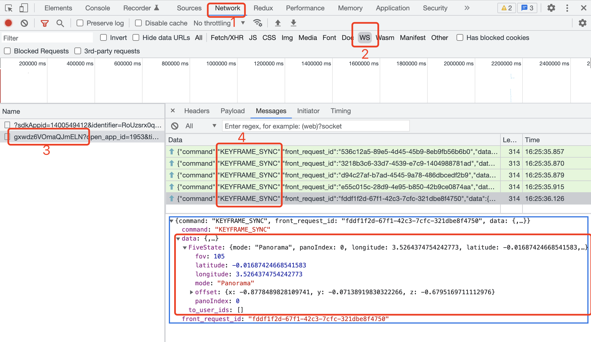
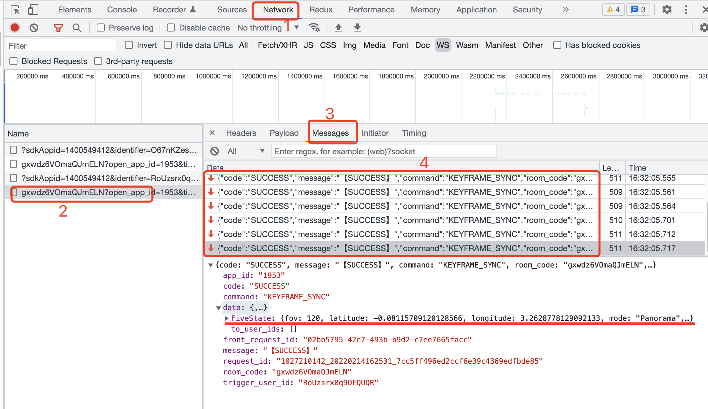

import Tabs from '@theme/Tabs'; import TabItem from '@theme/TabItem';

:::info
Live with WebSocket long chain communication capability, multiple users are connected to the same screen. Of these,**frame data in the message system**is the message carrier that performs the same screen.This section will describe how to proceed to the VR homogeneous screen. **Before developing the same screen, you need to prepare at least two watching roles：host and audience.** At the same time, we default that you have mastered how to view and set five status.
:::

## No Frame Example

<Tabs>
<TabItem value="JavaScript">

```jsx
five. n('stateChange', (state, userAction) => $US // Listen to local five state changes
    if(userAction) but send only five state changes from user operations
        // Send local frame data (Five State)
        live. endKeyframe ('FiveState', state)
    }
})


// Receive remote frame data (Five State)
live.keyframes n('FiveState', (newState, prevState) ==> {
    // Take the latest `newState` to update local UI status
    five. etState(newState, false, false) // set userAction values to false and avoid syncing death cycles.
})
```

</TabItem>
<TabItem value="TypeScript">

```tsx
five. n('stateChange', (state, userAction) => $US // Listen to local five state changes
    if(userAction) but send only five state changes from user operations
        // Send local frame data (Five State)
        live. endKeyframe ('FiveState', state)
    }
})


// Receive remote frame data (Five State)
live.keyframes n('FiveState', (newState, prevState) ==> {
    // Get the latest `newState` update local UI status
    five. etState(newState, false, false) // set userAction values to false and avoid syncing death cycles.
})
```

</TabItem>
</Tabs>

:::tip
Operation `for the moderator` VR, see the information in the network of the `moderator` side of the console.

As the moderator changes VR on his screen, their messages will continue to be sent `KEYFRAME_SYNC`.Click on the corresponding directive to view the detailed data transfer content.
:::





:::tip
See also `viewers` side consoles, find the web info in the console.

As moderators turn on VR messages receive `KEYFRAME_SYNC` instructions.Click on the corresponding command to see the details of the received data.
:::




:::tip
Sent out of the green arrows up and receive the red arrow down.
:::

## React Example

<Tabs>
<TabItem value="JavaScript">

```jsx
import LiveReact from 'LiveReact'
import { useFiveState } from "@realsee/five/react"

const { useKeyframe } = LiveReact

function Test () {
    const [fiveState, setFiveState] = useFiveState()
    const [fiveStateKeyframe, setFiveStateKeyframe] = useKeyframe('FiveState')
    
    // Monitor five state changes and send frame data
    useFiveEventCallback("stateChange", (state, userAction) => {
        // Only send user-triggered state changes
        if ( userAction) {
            setFiveStateKeyframe(state)
        }
    })
    
    // Receive frame data
    /*
    * const [fiveStateKeyframe, setFiveStateKeyframe] = useKeyframe('FiveState'),
    * useKeyframe() hook has set real-time The frame data is updated, and fiveStateKeyframe is the latest five state frame.
    * The receipt of frame data only requires diff useKeyframe() to check the first parameter value of the box and update the local UI instead.
    * Here's only need to listen to the changes made to your FiveStateKeyframe and update the five state.
    * */
    
    React.useEffect() => $US
        // ReviveStateKeyframe has changed as long as it can be here.
        setFiveState(fiveStateKeyframe, false, false) // set user action with state changes on the same screen to false.Avoid falling loop with screen.
    }, [fiveStateKeyframe]
    
    
    return null
    
}
```

</TabItem>
<TabItem value="TypeScript">

```tsx
import LiveReact from 'LiveReact'
import { useFiveState } from "@realsee/five/react"

const { useKeyframe } = LiveReact

function Test () {
    const [fiveState, setFiveState] = useFiveState()
    const [fiveStateKeyframe, setFiveStateKeyframe] = useKeyframe('FiveState')

    // Monitor five state changes and send frame data
    useFiveEventCallback("stateChange", (state, userAction) => {
        // Only send state changes triggered by users
        if (userAction ) {
            setFiveStateKeyframe(state)
        }
    })

    // Receive frame data
    /*
    * const [fiveStateKeyframe, setFiveStateKeyframe] = useKeyframe('FiveState'),
    * useKeyframe() hook has set the real-time frame The data is updated, and fiveStateKeyframe is the latest five state frame.
    * The receipt of frame data only requires diff useKeyframe() to check the first parameter value of the box and update the local UI instead.
    * Here's only need to listen to the changes made to your FiveStateKeyframe and update the five state.
    * **/

    React.useEffect() => {{
        // If you are able to go here, represent fiveStateKeyframe changes.
        setFiveState(fiveStateKeyframe, false, false) // set user action with state changes on the same screen to false.Avoid falling loop with screen.
    }, [fiveStateKeyframe]


    return null

}
```

</TabItem>
</Tabs>

:::tip
Operation `for the moderator` VR, see the information in the network of the `moderator` side of the console.

As the moderator changes VR on his screen, their messages will continue to be sent `KEYFRAME_SYNC`.Click on the corresponding directive to view the detailed data transfer content.
:::


:::tip
See also `viewers` side consoles, find the web info in the console.

As moderators turn on VR messages receive `KEYFRAME_SYNC` instructions.Click on the corresponding command to see the details of the received data.
:::


:::tip
Sent out of the green arrows up and receive the red arrow down.
:::
